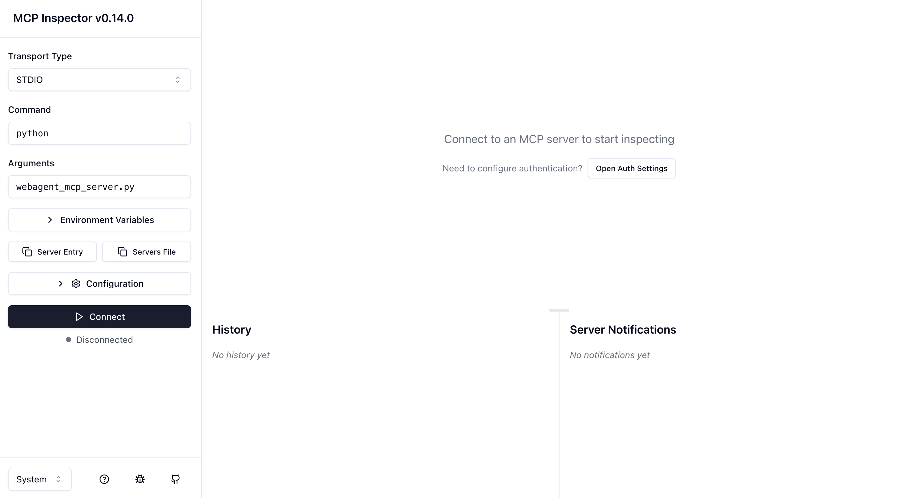
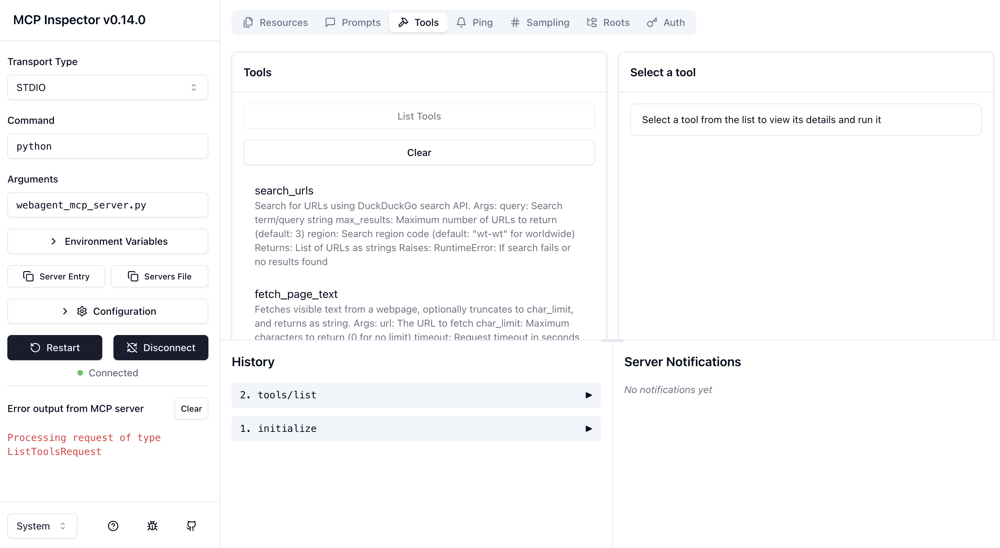

# MCP Client & Server Demo

This project is based on the [DeepLearning.AI course on the Model Context Protocol (MCP)](https://learn.deeplearning.ai/courses/mcp-build-rich-context-ai-apps-with-anthropic), which walks through building a low-level MCP setup using the official `mcp` libraries — including a tool server and a client that can autonomously invoke tools via an LLM.

While the course code already exposes core MCP mechanics, I wanted to fully internalize and improve the architecture.  
To do so, I made the following changes:

- **Switched from Anthropic to Ollama**  
  I replaced the Anthropic API with a local Ollama-based client so I can run open models like `qwen2.5` or `llama3` — offline, locally, and for free.

- **Refactored the code for clarity and maintainability**  
  The client logic is now more modular, testable, and easier to understand. I extracted the core agent loop into a clean `MCPAgent` class.

- **Built a web-focused tool setup instead of arXiv**  
  Instead of scientific search tools, I use DuckDuckGo search + HTML page parsing — turning the agent into a basic autonomous web researcher.

These changes helped me better understand how MCP works under the hood — from tool discovery and routing to result injection and multi-turn reasoning.

---

## 🔍 What does it do?

The client uses a local LLM to respond to user queries.  
It can **automatically invoke tools** like:

- `search_urls`: Uses DuckDuckGo to search for relevant links
- `fetch_page_text`: Downloads and extracts the text from a web page

The system prompt guides the LLM to use these tools **autonomously** to research and summarize information from the web.

Example:  
You ask **"What's the latest news on AI chips?"**  
→ The LLM will:
1. Use `search_urls` to find links  
2. Pick one  
3. Use `fetch_page_text` to extract the content  
4. Summarize it for you – all in one response.

---

## 📂 Project Structure

```
.
├── img
│   ├── mcp-inspector-tools.png
│   └── mcp-inspector.png
├── mcp_client
│   ├── __init__.py
│   ├── agent.py
│   ├── llm
│   │   ├── __init__.py
│   │   ├── config.py
│   │   ├── ollama_client.py
│   │   ├── prompts.py
│   │   └── tool_helpers.py
│   └── session.py
├── mcp_server
│   ├── __main__.py
│   └── tools
│       ├── fetch_page.py
│       └── search_urls.py
├── README.md
├── requirements.txt
└── tests
    ├── __init__.py
    ├── test_fetch_page.py
    ├── test_ollama_client.py
    └── test_search_urls.py
```


## 🚀 Start the Client

To launch the interactive MCP agent:

```bash
python -m mcp_client.session
```

This starts a local session that connects to your MCP server and interacts with it via a local LLM (e.g. Ollama).


### Testing with MCP Inspector

The MCP Inspector is a web-based tool for debugging and testing your MCP server in real-time. It allows you to inspect available tools, simulate tool calls, and verify responses before integrating with a client like this one.

#### 1. Install the MCP Inspector (if not already installed):
```bash
npm install -g @modelcontextprotocol/inspector
```

#### 2. Activate your virtual environment:
```bash
source venv/bin/activate
```

#### 3. Start the Inspector with your server:
```bash
npx @modelcontextprotocol/inspector python -m mcp_server
```

You should see a UI like this:







## ✅ Running Tests
To run a test module directly:

```bash
python -m tests.test_fetch_page
```

## ℹ️ Ollama Response Notes
The response from `ollama.chat()` (non-streaming) has the following structure:

```python
{
  "model": "llama3",
  "created_at": "...",
  "message": {
    "role": "assistant",
    "content": "..."
  },
  "done": True
}
```

If the LLM triggers a tool call, it will appear under:

```python
response["message"]["tool_calls"]
```

## 🛠️ Adding New Tools

This project supports **multiple MCP tool servers**, and you can connect as many as you like. Each server provides one or more tools that the LLM can invoke autonomously.

There are **two main types of tool servers** you can add:

### 1. Tools You Code Yourself (Inline or from GitHub)

You can add your own tools in Python, like the existing ones under `mcp_server/tools/`.  

Or you can reuse tool servers published by others — for example, from the official MCP server collection:

→ https://github.com/modelcontextprotocol/servers

Then you can run one of the provided servers (e.g. `arxiv-server`) by configuring it in `server_config.json`:

```json
{
  "mcpServers": {
    "default": {
      "command": "python",
      "args": ["-m", "mcp_server"]
    },
    "arxiv": {
      "command": "python",
      "args": ["external/mcp-servers/arxiv-server/main.py"]
    }
  }
}
```

> Tip: You can clone or copy individual tool server folders manually to keep your project lightweight.

---

### 2. Tools Installed via `pip` (Prebuilt Servers)

Some third-party servers are published as installable packages.

Example: the calculator tool server  
→ https://github.com/githejie/mcp-server-calculator

Install it via pip:

```bash
pip install mcp-server-calculator
```

Then add it to your `server_config.json`:

```json
{
  "mcpServers": {
    "default": {
      "command": "python",
      "args": ["-m", "mcp_server"]
    },
    "calculator": {
      "command": "python",
      "args": ["-m", "mcp_server_calculator"]
    }
  }
}
```

---

### 🔧 Adjusting the Prompt (Recommended)

To make sure your LLM knows when and how to use your new tool(s), you should also update the [system prompt](./mcp_client/llm/prompts.py) in `mcp_client/llm/prompts.py`.


Be clear and specific about:

- What the tool does  
- When to use it  
- What kind of input is valid  
- Whether it replaces or complements other tools  

This improves reasoning and tool selection dramatically — especially with local models like Qwen or LLaMA 3.